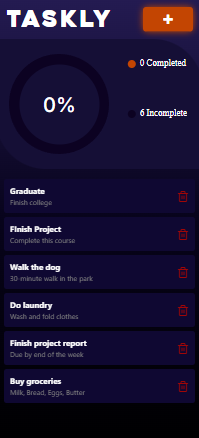
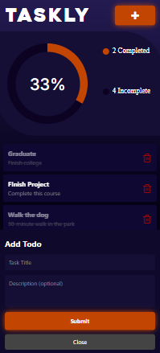

# TASKLY
A simple and clean To-Do List app that helps you manage your daily tasks with ease.

Taskly lets you add, view, and delete tasks in a smooth and organized interface. It also includes a Pie Chart to show your completed vs. pending tasks, giving you a quick view of your progress.

## Features
- **Pie Chart** – Shows task completion progress  
- **Add Task** – Quickly add new tasks  
- **Delete Task** – Remove tasks easily  
- Clean and simple UI

## Tech Used
- React Native / Expo  
- react-native-chart-kit  
- Expo components & basic hooks  

## Preview

<table align="center">
  <tr>
    <td align="center">
      
    </td>
    <td align="center">
      
    </td>
  </tr>
</table>

## How to Run
```sh
npm install
npm start
cd Taskly
npx expo start
